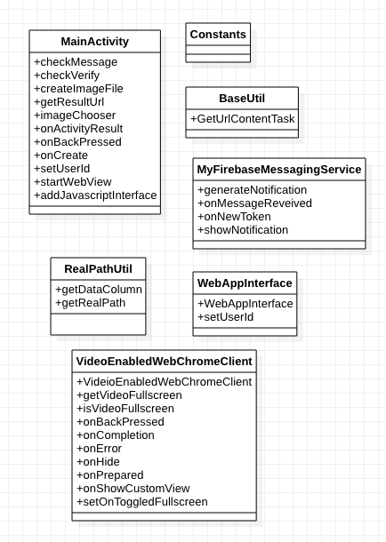

# 2019-2-OSSP1-Haejwo-1
### 동국대학교 학생들을 위한 심부름 애플리케이션

## 프로젝트 설명
시간이 부족하거나 공강시간에 할 일이 없는 동국대학교 학생들을 위한 앱으로, 인쇄, 복사부터 커피 배달 등 다양한 심부름을 요청할 수 있다. 심부름을 요청한 학생은 심부름을 수행한 학생에게 합리적인 보상을 제공하는 시스템이다. 가입 시 철저한 재학생 인증과 사용자 신고 기능을 제공한다.

## 개발환경
- Rails 5.2.3
- Ruby 2.6.4
- Android Studio 6.0

## 참고한 오픈소스
- [Framework7](https://github.com/framework7io/framework7/)
- [Rails](https://github.com/rails/rails)
- [ActiveAdmin](https://github.com/activeadmin/activeadmin)
- [Capistrano](https://capistranorb.com)
- [Google Maps API](https://developers.google.com/maps/documentation)
- [Sendgrid API](https://sendgrid.com/docs/API_Reference/api_getting_started.html)
- [FireBase](https://firebase.google.com/)
- [Kakao Rest API](https://developers.kakao.com/docs/restapi)
- [Facebook Rest API](https://developers.facebook.com/docs/facebook-login/web?locale=ko_KR)

## 배포
[AWS(https://aws.amazon.com)](https://aws.amazon.com)의 Ubuntu ec2 instance 서버 활용, elastic ip 설정 그리고 ubuntu 서버에 필요한 페키지 셋팅 후 레일즈 서버 연동작업, 도메일 연결 작업 진행. capistrano를 이용해 깃헙 레포지토리에 있는 rails server 소스코드 변경사항을 실서버에 자동 배포 작업가능하게 설정했다. local 환경에서 github master branch에 최신사항 반영후, cap production deploy라는 명령어로 배포 진행하였고, assets precompile, migrate, touch tmp/restart.txt 등등 자동 설정으로 빠른 테스트 진행 가능하도록 설정했다. 개인정보가 필요하므로, letsencrypt(certbot) 활용하여 https 셋팅.

## 팀원
- [장성원(팀장)](https://github.com/godwon2095)  
- [연제훈](https://github.com/YJHoon)  
- [이주영](https://github.com/JuYeong0413)

# Design (Class Diagram)

## Rails ER DIAGRAM

<object data="/haejwo-server/erd.pdf" type="application/pdf" width="700px" height="700px">
    <embed src="/haejwo-server/erd.pdf">
        
Rails ER Diagram 보기: <a href="/haejwo-server/erd.pdf">Download PDF</a>.

    </embed>
</object>

## Android

